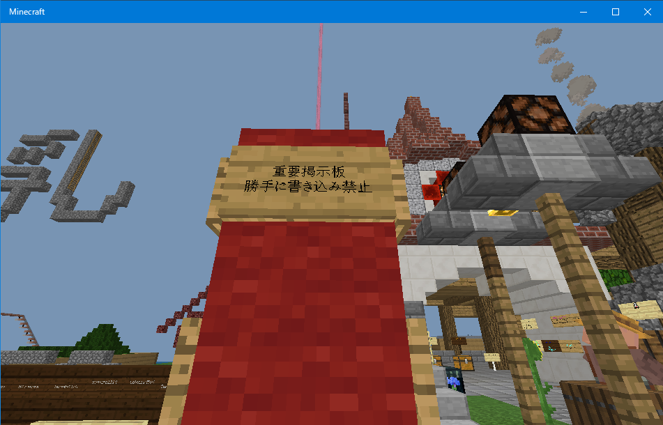
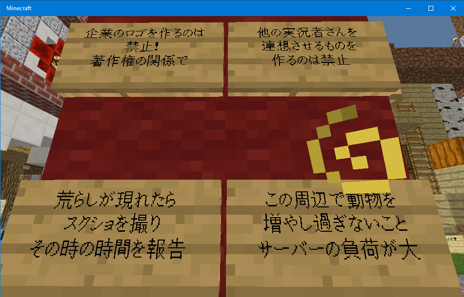
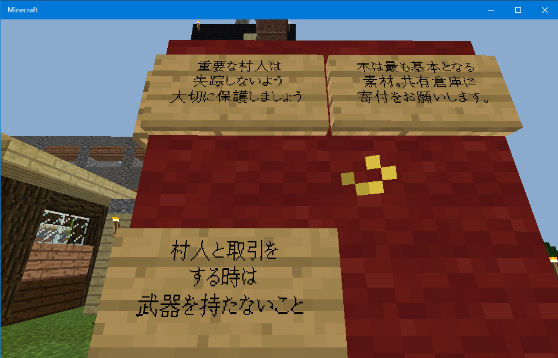

にゅうワールドとこのウィキ(にゅうワールド情報ウィキ)の利用規約です。

## 紳士のお言葉
<blockquote class="twitter-tweet" data-lang="ja">
紳士鯖民へ  こんだけ人数が多いと、僕の命令を無視して勝手に行動したり、不祥事を起こす人が出てきてもおかしくないです。  だからといって犯人探しに躍起になって、ギスギスした空気になるのはよろしくない。  楽しく遊ぶ。これを大事に。 多少のトラブルは目をつむりましょう。
&mdash; Hamano Y＠ゆっくり実況者 (@Hamakun_U) <a href="https://twitter.com/Hamakun_U/status/1174701628584280064?ref_src=twsrc%5Etfw">2019年9月19日</a></blockquote>

## 重要掲示板
ワールドのリスポーン地点に置かれている重要掲示板です。 
ここに書いてある事も守ってください。 
 
 

## にゅうワールド法
### 適用範囲
**Hamanoさんの Minecraft Realms サーバーの「にゅうワールド」**

### 第零条 (第〇条) 大原則
以下の法は、**Hamanoさんの元**にあり、**Hamanoさんの指示**が**以下の法**の**権限を上回る**ものとする。

* *要約：**Hamanoさん**の言う事は聞きましょう。*

### 第壱条 (第一条) 窃盗法
<u>いかなる場合においても</u>、**所有者**の許可無しに他人の物を**窃盗**することを禁ずる。

* *要約：人のアイテムを盗むのは止めましょう。*

### 第弐条 (第二条) 建築物保護法
<u>いかなる場合においても</u>、**所有者・管理者**の許可無しに他人の建造物を**破壊**することを禁ずる。 
ただし、共有の建造物は、**所有者・管理者**は**Hamanoさん**とする。

* *要約：人の家を壊したり改造するのは止めましょう。*

### 第参条 (第三条) 動物愛護法
<u>いかなる場合においても</u>、**所有者**の許可無しに他人のペットを**殺害**することを禁ずる。

* *要約：ペットの命は大切にしましょう。*

### 第肆条 (第四条) 侵入法
<u>いかなる場合においても</u>、**所有者・管理者**の許可無しに他人の建造物への**侵入**を禁ずる。
ただし、共有の建造物は、**自由に入れる**ものとし、**侵入を禁止**することを禁ずる。

* *要約：人の家に勝手に侵入するのは止めましょう。*

### 第伍条 (第五条) 村人法
<u>いかなる場合においても</u>、**保護されている村人**の**殺害**を禁ずる。

* *要約：無暗やたらに村人を倒すのは止めましょう。*

### 第陸条 (第六条) 大規模干渉法
<u>いかなる場合においても</u>、**Hamanoさん**の許可無しにワールドに関する**大規模な干渉**することを禁ずる。
1. ~~エンドの開通、及び、エンダードラゴンの討伐。~~
	* エンドはHamanoさんの権限で攻略された為、解放されました。
2. 外部ツールを利用する事による不正。
	* クリエイティブモード、チートコマンド、等

* *要約：その他悪質な行為は止めましょう。*

### 第漆条 (第七条) 管理者法
運営が**放置されている**と判断された建造物は、その時点で看板を建てられ、 
それから**二週間以上**経過しても放置が続けられている場合は、**管理権を失う**。

* *要約：建造物を放置し続けると管理権が無くなりますよ。*

### 第捌条 (第八条) 戦闘法
原則として、相手の合意の有無に関わらず相手(プレイヤー)への故意による攻撃は禁止とする。

* *要約：ケンカは程々にしましょう。*

<!--
### 第玖条 (第九条) 区分け法
以下の記事に従って区分けを実施する。尚、上記のルールに競合する場合は区分け法を優先する物とする。

* *要約：以下の記事を読んで地区ごとのルールを把握してね。*

-->

### 補足
にゅうワールド法は何か問題が起きる度に規約を更新します。

### 変更
* **2019/09/29**: 法律の名前を追加。
* **2019/09/22**: 重要掲示板追加。
* **2019/09/22**: 誤字の修正。
* **2019/09/21**: 漢数字を大字に変更。
* **2019/09/20**: 第八条追加。
* **2019/09/19**: 要約追加。
* **2019/09/19**: 初版作成。

## にゅうウィキ法
### 適用範囲
**Takymが運営するにゅうワールド情報ウィキ**

### 禁止事項
このウィキに貼られている画像と情報の無断転載。

### 補足
にゅうウィキ法は何か問題が起きる度に規約を更新します。

### 変更
* **2019/09/19**: 初版作成。

## ネタルール
こちらのルールは守る必要はありませんが、守らないとワールドの警察に逮捕されます。 
ネタなのでそれぞれのルール同士で矛盾している場合があります。 
にゅうウィキ法が必ず優先される事を絶対に忘れないでください。

* [薬物に関しての法律](articles/2019/09/28/drag-rules.html)
* [人身売買の法律](articles/2019/09/28/villager-rules.html)
