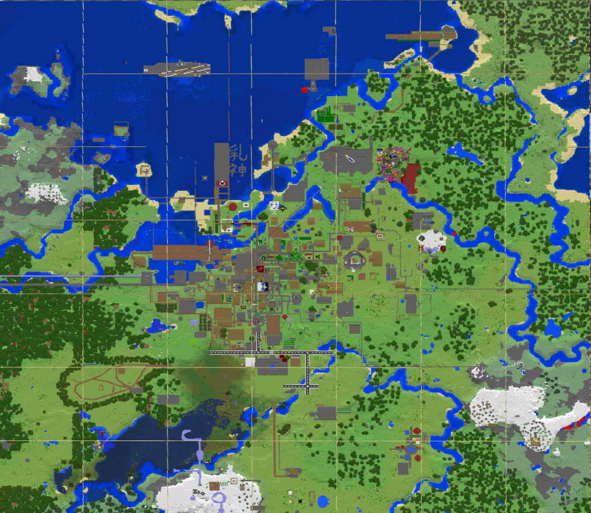
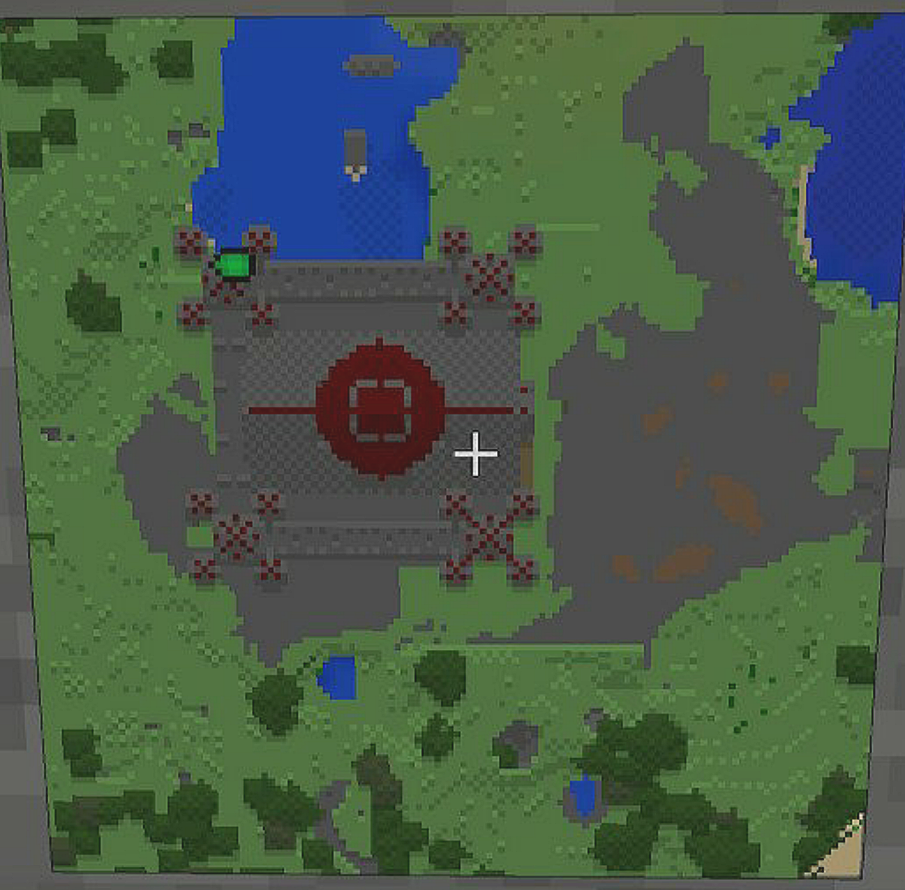

ワールドの地図の一覧です。<br />
サーバーの参加人数が多く急速に変化する為、最新情報ではないかもしれません。<br />
秋冬IMさん、地図更新お疲れ様です。この場を借りてお礼を言います。いつもありがとうございます。

## 別ディメンションの地図
* [地獄(ネザー, Nether)](nether.md)


## 地方の大まかな位置関係
```
[宝HOKY][天AMGW]
[秋SHSN][荷TTFS]
```


## 天河地方(あまがわ-ちほう, Amagawa Area, 天AMGW)
### どんな地方？
中央にはリスポーン地点がありワールドの中心になっています。<br />
どの地方よりも一番発展しています。

### 名前の由来
天河の意味は基本的に以下の意味しかありません。<br />
天の川銀河みたいな感じで恰好いいですよね！
 * 「**天**」：ワールドが誕生した頃から繁栄しており、現在もにゅう民達が暮らしています。
 * 「**河**」：二つの川があり文化の繁栄に適しています。

### 2019年10月24日


### 区分け地図と過去の地図
[こちら](amagawa.md)に移動しました。


## 宝京地方(ほうきょう-ちほう, Houkyo Area, 宝HOKY)
### どんな地方？
天河地方の西側にあり西部とも呼ばれています。<br />
建築物が増えたため天河地方の土地が無くなってきており、<br />
新たな建物を作れなかった為誕生しました。

### 名前の由来
宝が溢れる都という意味です。<br />
それ以外の意味はありません。<br />
また、鳳郷、奉興、峰鏡、法響とも呼ばれています。(当て字募集中です。)

### 2019年10月05日


## 荷産地方(にさん-ちほう, Nisan Area, TTF Spawners District, 荷TTFS)
### どんな地方？
トラップが溢れる地方です。<br />
経験値やアイテムが欲しい方はこの地方に行くといいでしょう。

### 主な施設
* [四連スポナー](nisan/quad_spawners.md)
* 二チャンクスライムトラップ
* 二連天空トラップ(?)

### 名前の由来
荷産は2と3の音価を表しており、また、「荷を産む」という言葉の省略となっています。<br />
英語名の TTF は Two, Three, Four と Trap Tower Forever のかばん語です。<br />
決して True Type Font の名称盗用ではありませんので、間違えないで頂きたい。

### 2019年10月10日



## 秋仙地方(しゅうせん-ちほう, Shusen Area, 秋SHSN)
### どんな地方？
商業が盛んに行われる地方です。<br />
貴方もお店を出店してみてはいかが？

### 名前の由来
元々、商業の土地なので「守銭」と呼ばれていました。<br />
しかし、「守銭」という単語はあまり良い意味合いを持っていない為、<br />
また、秋に美味しい食べ物が取れる山でもあるので、秋仙地方となりました。
