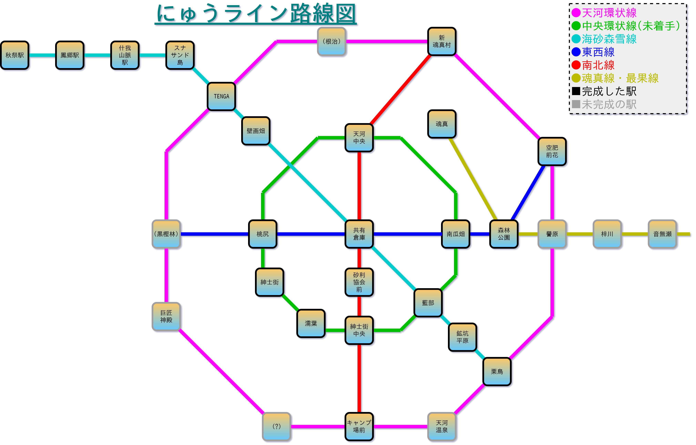
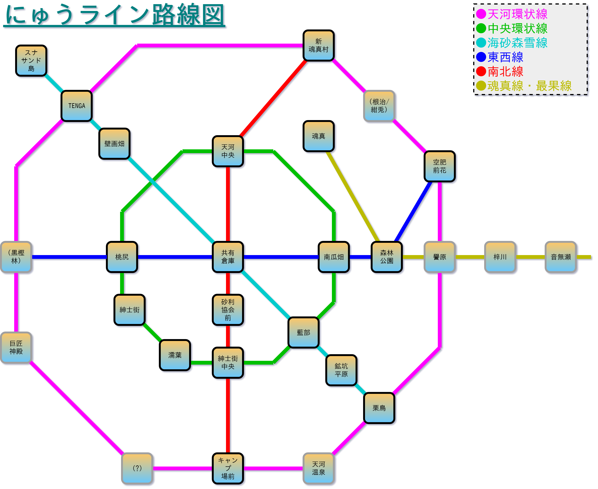
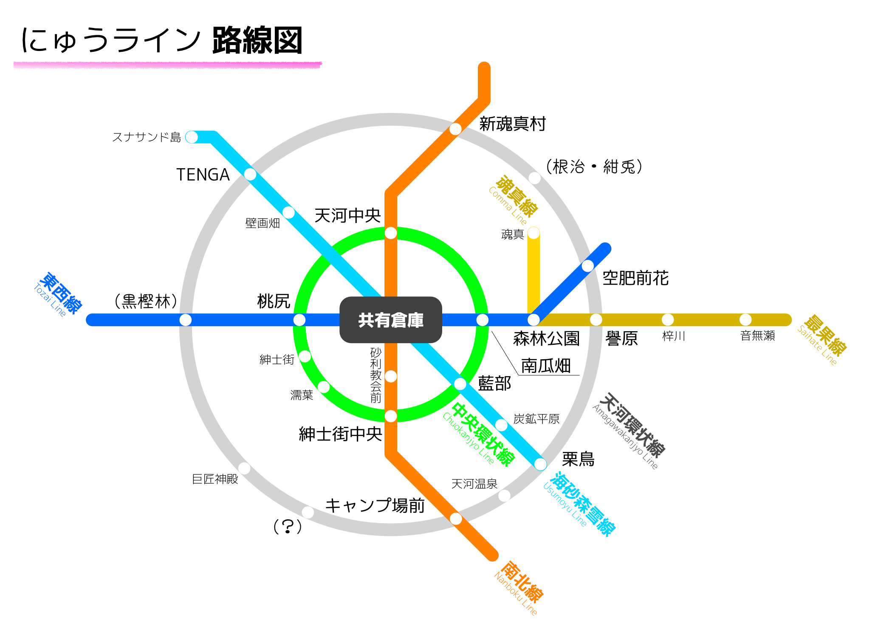

古い路線図です。歴史を感じたい人向けです。 
最新の物を上に表示しています。

## 現在の路線図 2019年10月15日 (最新版)
 
海砂森雪線を秋祭駅まで伸ばしました。

## 2019年09月29日
 
名前未定の駅(予定:根治/紺兎)を新魂真村と空肥前花の間からTENGAと新魂真村の間に移動しました。

## 2019年09月24日
 
路線図を新しい見た目に変更しました。

## 2019年09月24日
 
前のバージョンの地図もあります。

## 2019年09月18日

## 2019年09月17日

## 2019年09月16日

## かなり前の路線図
以下の路線図は路線計画中に一時的に使用したプロトタイプです。

### 2019年09月15日
 
元々、環状線は円ではなく四角で描かれていました。

### 2019年09月14日
 
最初期頃の路線図です。この頃は地図の上にそのまま線を書いていました。
