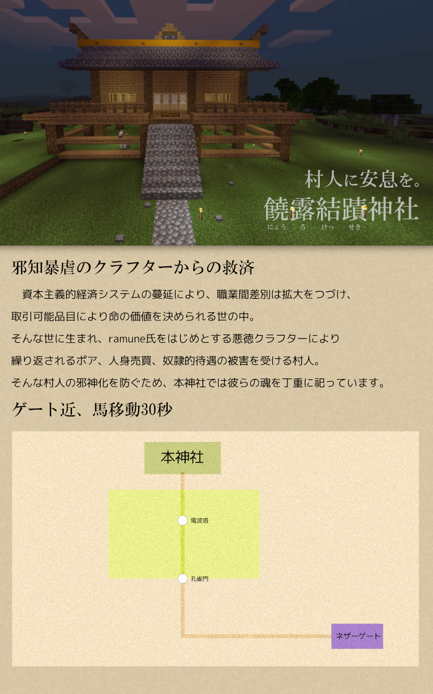

天河地方の建築物、家、施設、トラップ等の情報です。 

## 荷産地方
荷産地方の施設は以下のページをご覧ください。
* [四連スポナー](nisan/quad_spawners.md)

## 共有倉庫
ワールド参加者が誰でも利用できるアイテムを格納した倉庫です。 
使い過ぎには気を付けましょう。 
 

### 屋上「屋根」
 
ただの屋根です。何もありません。屋上としても使う事ができます。

### 地上2階「ロッカー」
 
アイテムを保管しておく為のロッカーがあります。 
利用中のロッカーからアイテムを盗むのは禁止です。 
ここには、南北線と海砂森雪線の駅もあります。

### 地上1階「全般倉庫」
 
 
全般的に使われるアイテムがあります。

### 地下1階「特殊倉庫」
 
特殊な用途で使われるアイテムがあります。 
現在は鉄道に関する倉庫があります。 
今後も色々な倉庫を作っていく予定です。 
ここには、東西線の駅もあります。

## 作業場
クラフト、製錬、醸造、エンチャント等の作業をする場所です。 

### 地上3階
 
※現在は誰にも利用されていません。

### 地上2階
 
エンチャント施設です。 
エンチャ台と金床があります。

### 地上1階
 
 
基本的な作業場です。 
作業台、かまど、醸造台等が置いてあります。

## 共有倉庫と作業場
共有倉庫と作業場の裏側の写真です。 
 

## 図書館
にゅう民が書いた本が読めます。 
 
この項目はまだ書き掛けです。図書館について詳しい方、情報提供お待ちしております。

## 饒露結蹟神社
 
「にょうろけっせき」と読むらしいです。

## 村紹介
酸素原子さんが寄稿してくれました。
* [村紹介](village.md)

## 記念碑紹介
写真は秋冬IMさんが過去に集めた物です。
* [記念碑紹介](monument.md)
