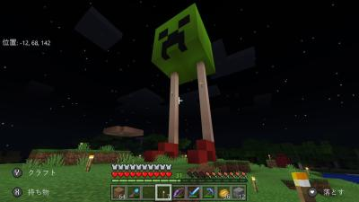
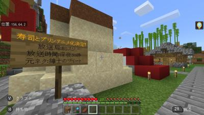
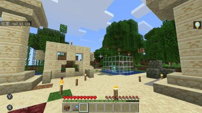
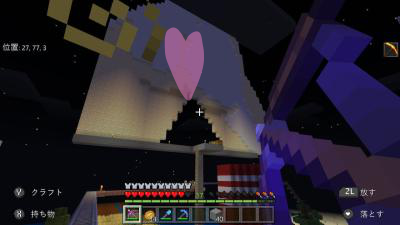
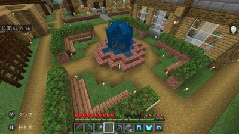
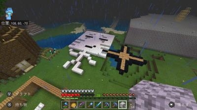
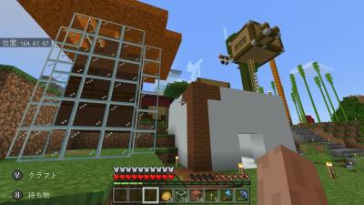
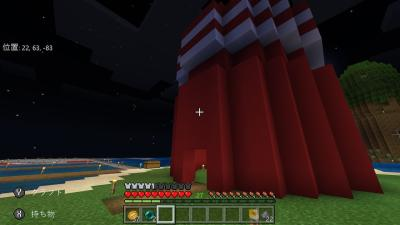
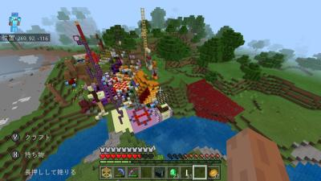
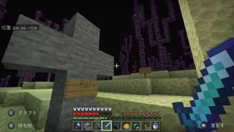

ワールドに幾つかある記念碑を紹介します。

## ハイヒールクリーパー
 
魅惑の美脚で比較的温厚なクリーパーです。通常、敵対しません。 
ただし、攻撃してきた相手には容赦無く自慢のハイヒールのかかとで、 
相手の足を踏んで指の骨を折ります。 
高速で走れるので敵対したら飛行機等で逃げましょう。 
ピ村のハイヒールクリーパーとは違い、にゅうワールドのハイヒールクリーパーは、 
既に去勢手術を受けている為、発情期・産卵期は訪れません。

### 細かい情報
* **体重**：90t
* **速度**：600km/h

## 寿司とプリン
 
ただの寿司とプリンです。アニメ化が決定しました。 
Hamanoさんの Twitter での呟きが元ネタです。 
<blockquote class="twitter-tweet">
今日の朝ごはんは寿司とプリン！ なんかアニメのタイトルみたいだな、  寿司とプリン。
&mdash; Hamano Y＠ゆっくり実況者 (@Hamakun_U) <a href="https://twitter.com/Hamakun_U/status/1172290549920882688?ref_src=twsrc%5Etfw">September 12, 2019</a></blockquote> 

## 巨匠神殿
 
クリーパーがガラスに展示されています。

## 砂と羊毛の壁
 
ただの壁です。何か別の物に見える人は心が汚れています。 
そのランダムな配置が美しく妖しい為、人の心を惑わします。 
モラルガーディアン無しの素の壁が見たい方は是非リス地付近の巨大畑に行ってみましょう。

## すじ公園
 
かつてはHamanoさんの顔がこの公園のシンボルでした。 
元々この場所には牛の牧場がありましたが負荷が掛かった為無くなりました。 
噴水がモニュメントなのでこのページに分類しました。

## 羊毛とグロウストーンの島
 
ただの地上絵です。何か別の物に見える人はきっと記憶力が高いのでしょう。 
正体は昔のこれでいいのか？マインクラフトを見てみましょう。

## 豆腐ハウス＆醤油
 
秋冬IMさん作の豆腐ハウスです。 
ネギと辛子が付いてるそうです。

## てぃーいーえぬじーえー
 
赤いドームに白い線が重なっている謎の塔です。 
天河地方の至る所に点在しており観光地になっています。 
宝京地方に天河地方の大使館として建てられていたり、 
中にスポナーが入って居たり、北天河区にある島の名前になっていたり、 
天河地方のシンボル的な存在になっています。

## カオス空間＆ネザーウォートバイオーム
 
人工的に自然生成された狂気に満ち溢れたバイオームです。 
実はかなりレア度(0.0256%の確率)が高く、稀にしか生成されません。

## とある部員の墓
 
第一次エンドラ討伐終了後にエンドの探索を行った某部員さんが無念に息絶えてしまいました。 
その時に初めて作られたエンドの建築物です。
