スポナーが3種類(スケルトン、ゾンビ、蜘蛛)あり、合計で4つのスポナートラップがあります。 
(※スケルトントラップだけ2つあります。) 
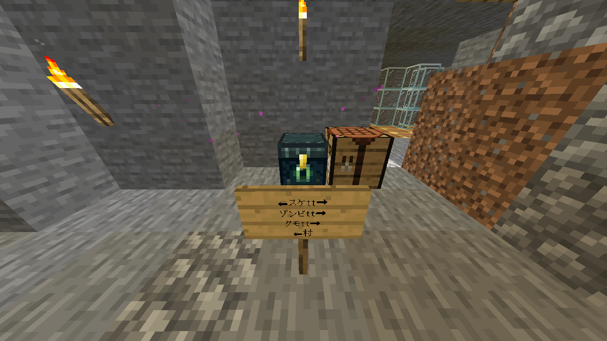 
また、この施設は荷産地方の中心部でもあり、トラップ以外の施設もあります。 
場所はみっしぇる城の下です。ネザー経由で南の方へ(要塞方面)に行くとあります。

## スケルトントラップ (中央)
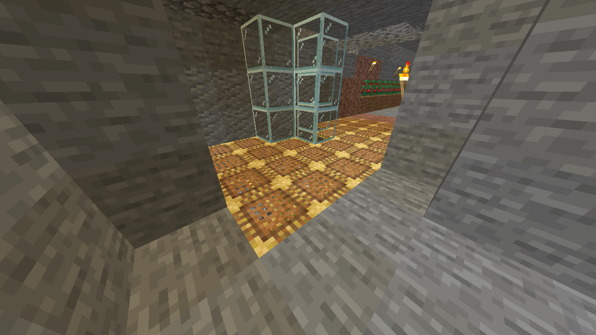 
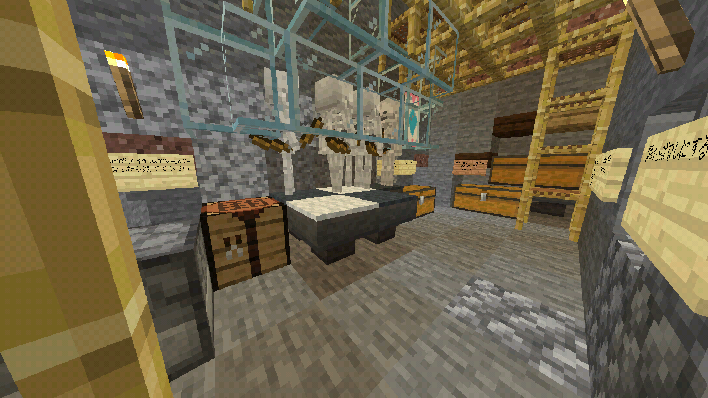 
場所はネザーゲートから出てすぐ目の前にあり素手で一撃で倒せます。 
経験値を貯める時にはとても便利です。 

## ゾンビトラップ
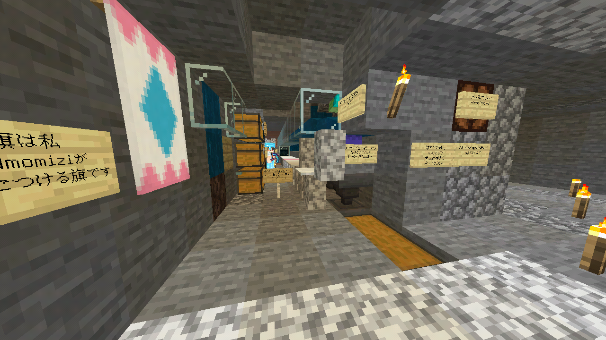 
物を修理する時に使うと便利です。 
奥にレバーがありドラモードとゾンビモードで切り替えることができます。 
左の一番下のチェストに石の剣が入っており自由に使うことができます。 
 
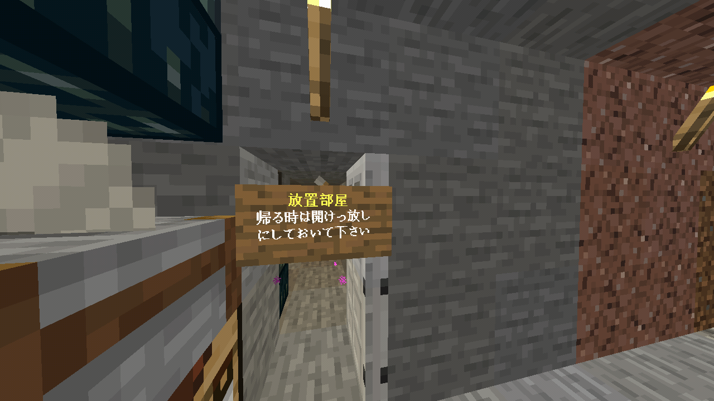 
放置する時はこの放置部屋の中に入ってください。 
チビゾンビが脱走することがあります。 
 
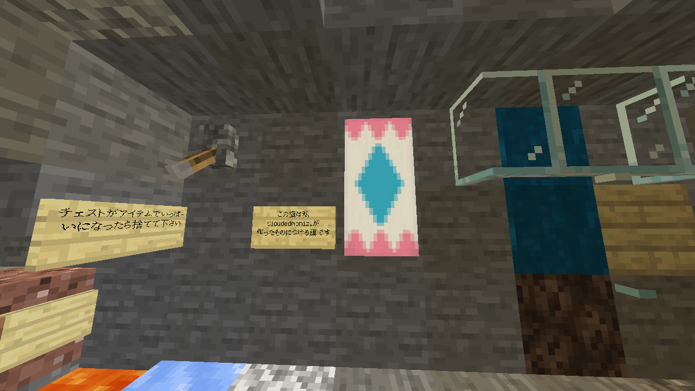 
この旗はCloudedmomiziさんが作った旗です。

## 蜘蛛トラップ
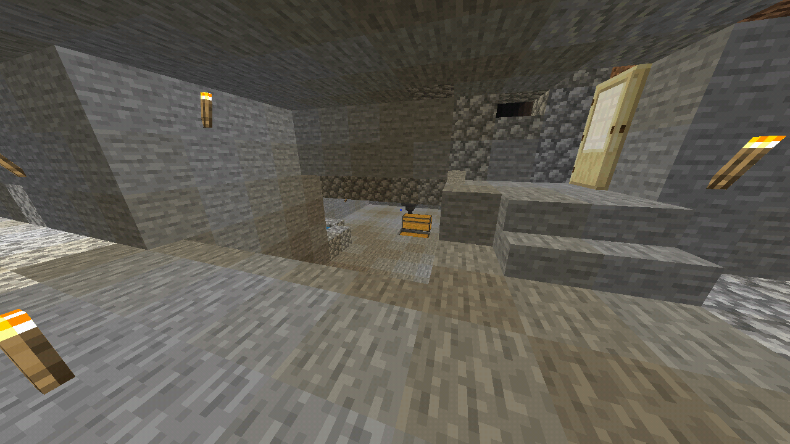 
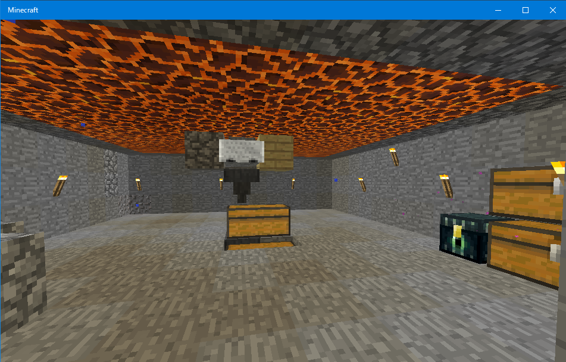 
蜘蛛を自動で倒してくれます。 
チェストの中には糸と蜘蛛の目が沢山入っていて臭いので開けっ放しにしないでください。

## スケルトントラップ (村)
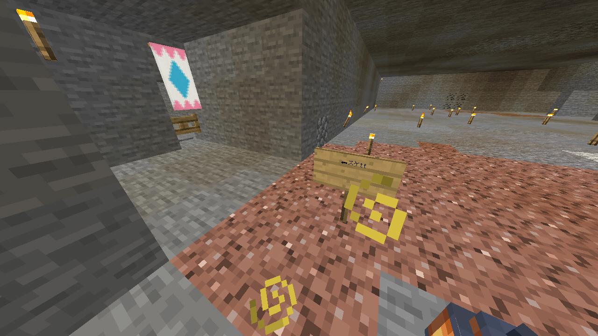 
Nラムネさんが作った村(下記参照)の奥にスケルトントラップがあります。 
ここも素手で一撃で倒すことができます。

## 村
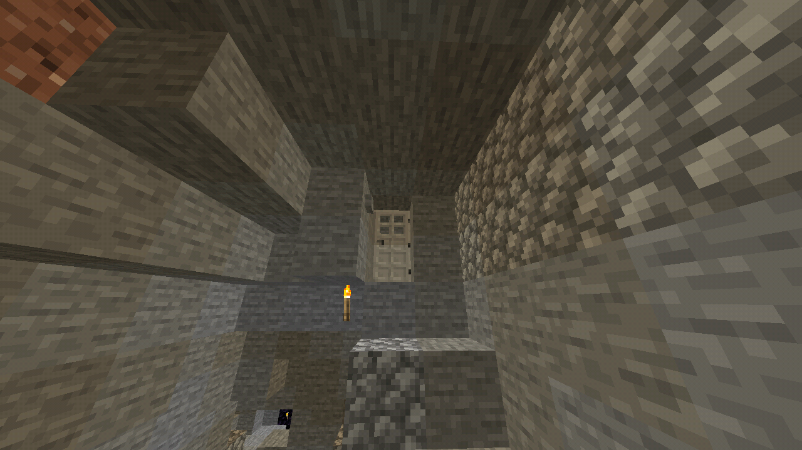 
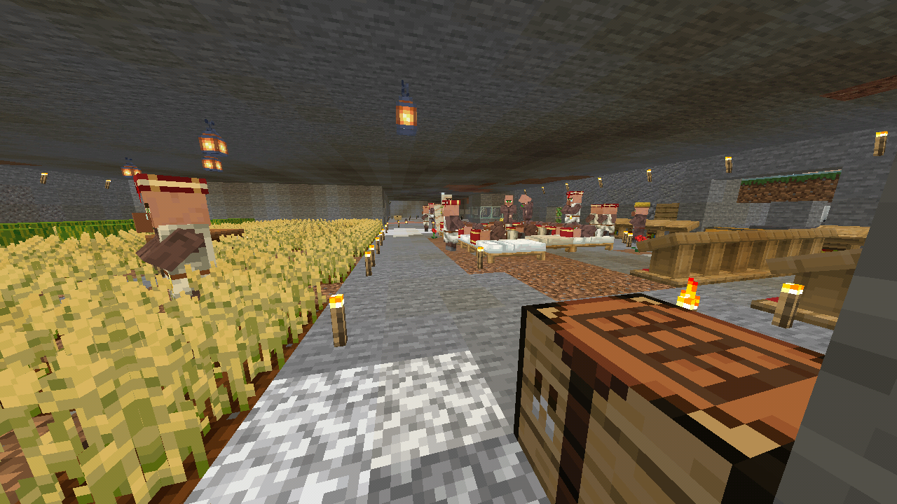 
ネザーゲートから左側に行くと鉄ドアがありそこに入るとNラムネさんが作った村があります。 
 
 
ここのチェストはラムザ氏の私物のため取らないでください。 
 
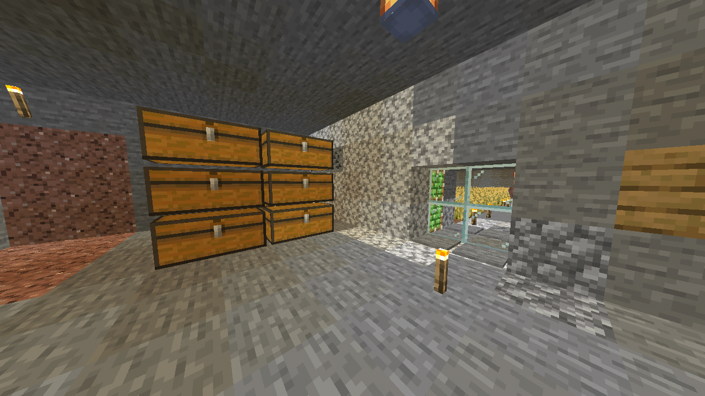 
ここは立ち入り禁止区域です。

### エンチャント台と共有倉庫
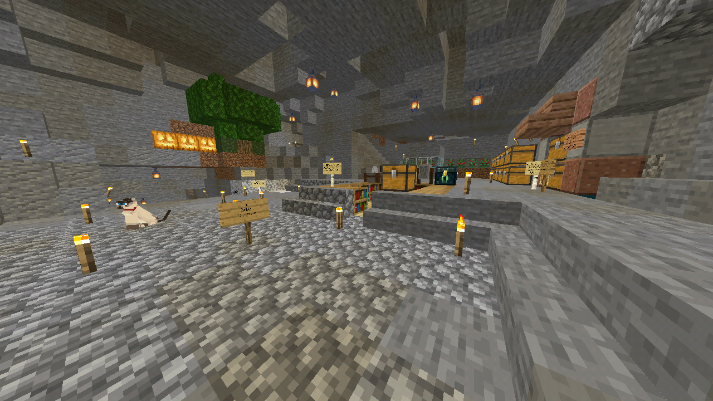 
ここでエンチャントする事ができます。 
右に「おいもショップ」があり食料がテイクフリーで売っています。 
倉庫からは勝手に取っても大丈夫です。 
 
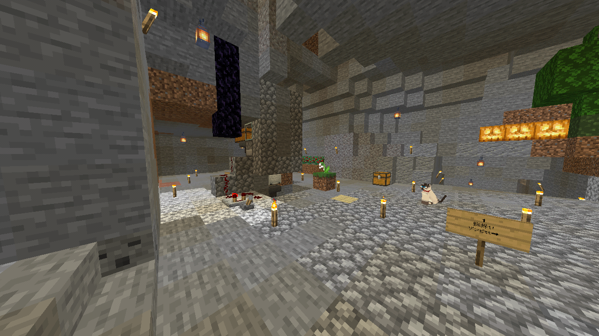 
これはサトウキビ自動収穫機です。 
骨粉を入れると自動で収穫してくれます。

### かまど
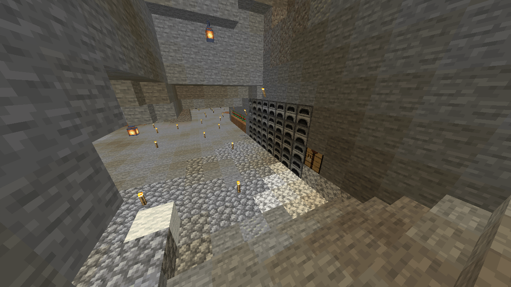 
左にマグマ溜りがあるのでガラスや焼き石が作り放題です。

### 謎の回路
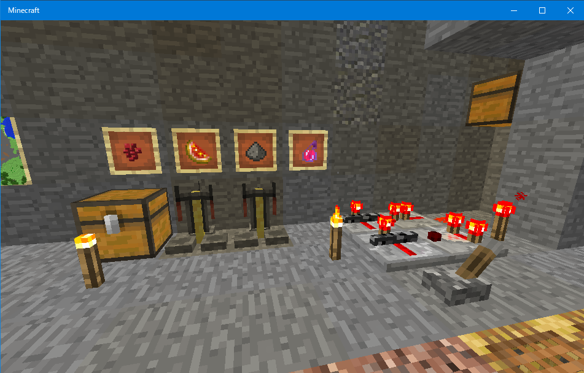 
用途不明の回路です。リピーターロックで常に信号が発生しています。 
隣の額縁や醸造台、チェストも用途不明です。 
多分、ここでポーションを作っている人がいるのでしょう。
