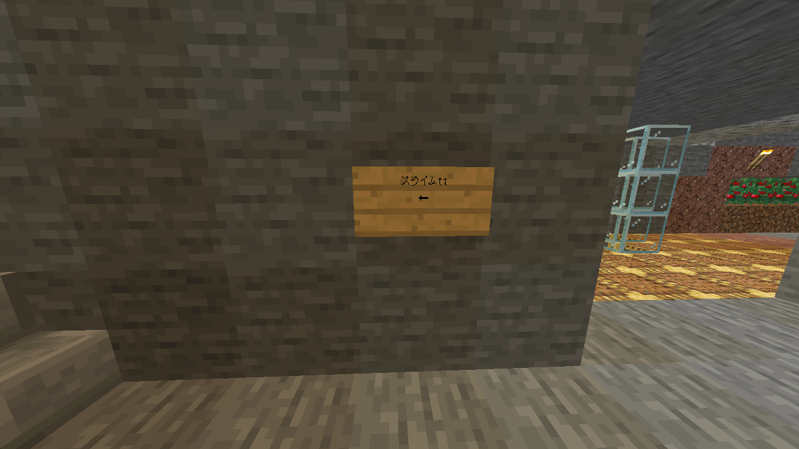
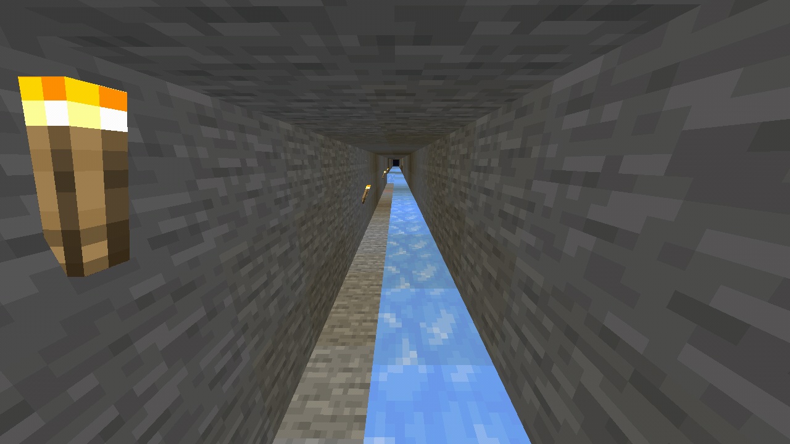
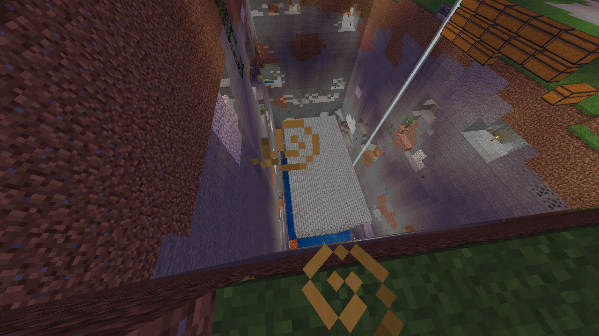
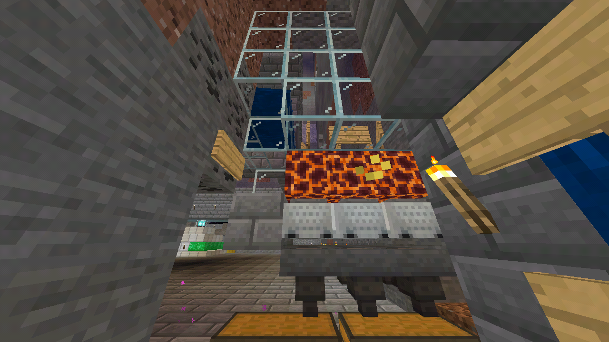

スライムボールを集めるトラップです。 
荷産地方の[四連スポナー](quad_spawners.md)の近くにあります。

## 入口
以下の様に四連スポナーのネザーゲート前に看板があります。 
その左側に行くとスライムトラップへ行けます。 
 
道は氷を使って舗装されているので、ボートで行くといいでしょう。 
 

## 上から見た様子
 
露天掘り跡の様な見た目になっています。

## トラップ正面
 
湧いたスライムは自動で抹殺されます。 
経験値を稼ぐのには向かないトラップです。 
効率はそこまで高くありませんが(統合版なので仕方ないです)、 
チェストに入って居るスライムボールは自由に持って行って構いません。
